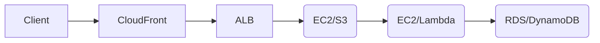

Here's a clear comparison of **Web Server vs Application Server vs Database Server** in AWS, including key AWS services for each:

---

### **1. Web Server**  
| **Purpose**       | Serves static/dynamic web content (HTML, CSS, JS, images) |  
| **AWS Services**  | - **EC2** (Apache/Nginx)   - **S3** (Static hosting)   - **CloudFront** (CDN)   - **Lightsail** (Pre-configured) |  
| **Key Features**  | - Handles HTTP/HTTPS requests   - Scales with **ALB/ELB**   - Low-latency delivery via **CloudFront** |  
| **Example Use**   | Hosting a company website or blog. |  

---

### **2. Application Server**  
| **Purpose**       | Executes business logic, processes dynamic requests (APIs, computations) |  
| **AWS Services**  | - **EC2** (Custom apps)   - **Elastic Beanstalk** (PaaS)   - **Lambda** (Serverless)   - **ECS/EKS** (Containers) |  
| **Key Features**  | - Runs backend code (Python, Java, Node.js)   - Connects to databases   - Scales with **Auto Scaling Groups** |  
| **Example Use**   | Processing user login requests or payment transactions. |  

---

### **3. Database Server**  
| **Purpose**       | Stores, manages, and retrieves structured/unstructured data |  
| **AWS Services**  | - **RDS** (MySQL/PostgreSQL)   - **DynamoDB** (NoSQL)   - **Aurora** (High-performance SQL)   - **Redshift** (Data warehouse) |  
| **Key Features**  | - ACID compliance (RDBMS)   - Automated backups   - Read replicas for scaling |  
| **Example Use**   | Storing customer orders or user profiles. |  

---

### **Key Differences**  
| **Aspect**        | **Web Server**          | **Application Server**   | **Database Server**     |  
|-------------------|------------------------|-------------------------|------------------------|  
| **Primary Role**  | Content delivery       | Business logic          | Data storage           |  
| **Scalability**   | Horizontal (ALB)       | Vertical/Horizontal (ASG) | Read replicas (RDS)   |  
| **AWS Managed**   | S3 + CloudFront        | Elastic Beanstalk/Lambda | RDS/DynamoDB          |  
| **Latency Needs** | Low (edge locations)   | Moderate                | High (persistent storage) |  

---

### **How They Work Together in AWS**  

1. **Client** requests a webpage via **CloudFront** (CDN).  
2. **Web Server** (EC2/S3) serves static content or forwards dynamic requests to **Application Server**.  
3. **Application Server** (Lambda/EC2) processes logic and queries **Database Server** (RDS).  
4. **Database Server** returns data to Application Server, which formats the response for the client.  

---

### **When to Use Which?**  
- **Web Server**: Static content, caching, low-latency delivery.  
- **Application Server**: APIs, microservices, compute-intensive tasks.  
- **Database Server**: Persistent data storage, transactions, analytics.  

AWS integrates these seamlessly (e.g., **ALB → EC2 → RDS**). For serverless: **CloudFront → Lambda → DynamoDB**.  

Let me know if you'd like architecture examples! 🚀